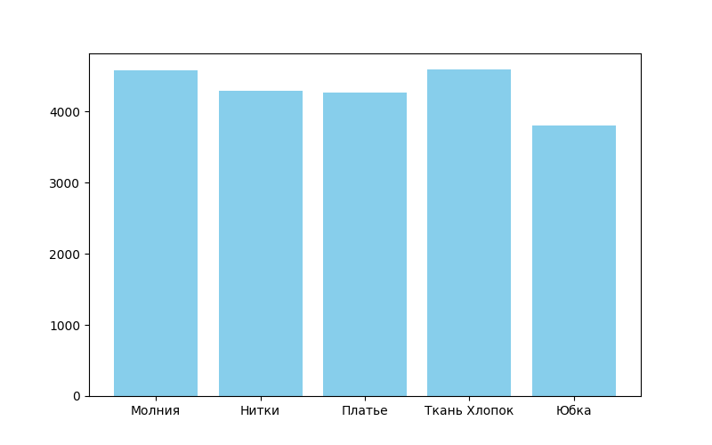
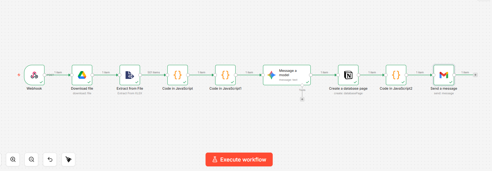
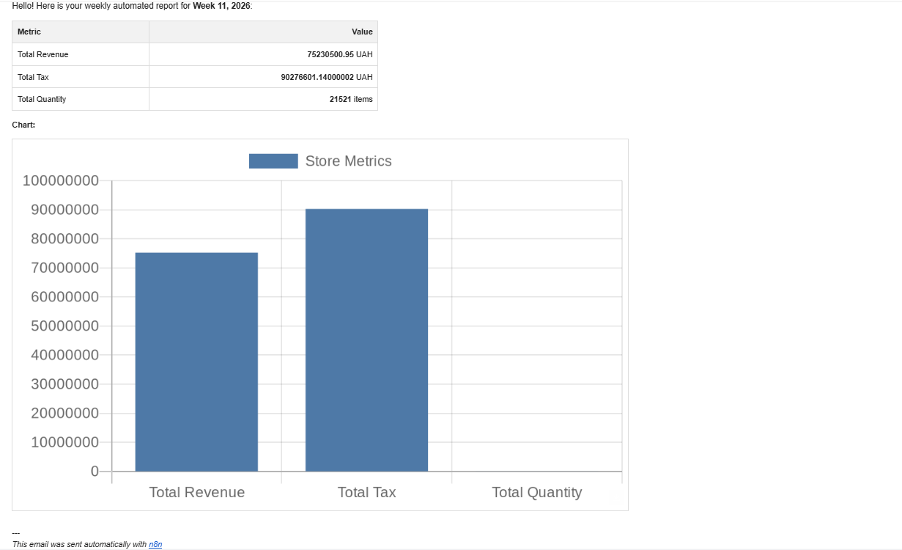
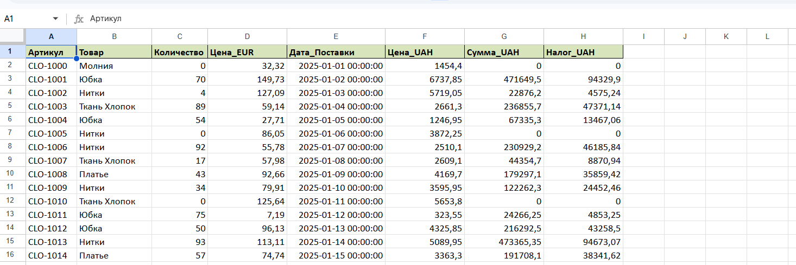

# Warehouse Analytics Automation

Python project for warehouse analytics with AI reporting and automation.

## Technologies

- Python
- Pandas
- Matplotlib
- Gemini AI
- n8n
- GitHub

## Project Description

This project analyzes warehouse data, calculates sales metrics and generates an AI-based analytical report.

The script processes Excel data and produces:
- warehouse data analysis
- sales statistics calculation
- tax calculations
- data visualization (chart)
- automation workflow with n8n
- automated AI analysis

## Files

inventory.py – main analytics script

Склад_Python + Notion.json – n8n automation workflow

inventory_chart.png – example generated chart

## Example Chart

## Automation

The Python script integrates with n8n automation to send reports to external services such as Notion or email.

## Author

Maryna – automation and data analytics learning project
## Automation Workflow

This project uses n8n to automate the data pipeline.

## Example Automated Report

The automation sends a generated report via Gmail.

## How to Run

1. Install Python
2. Install required libraries

pip install pandas matplotlib python-dotenv google-generativeai

3. Add your API key to .env

4. Run the script

python inventory.py
## Example Input Data

The project processes warehouse data stored in Excel.

